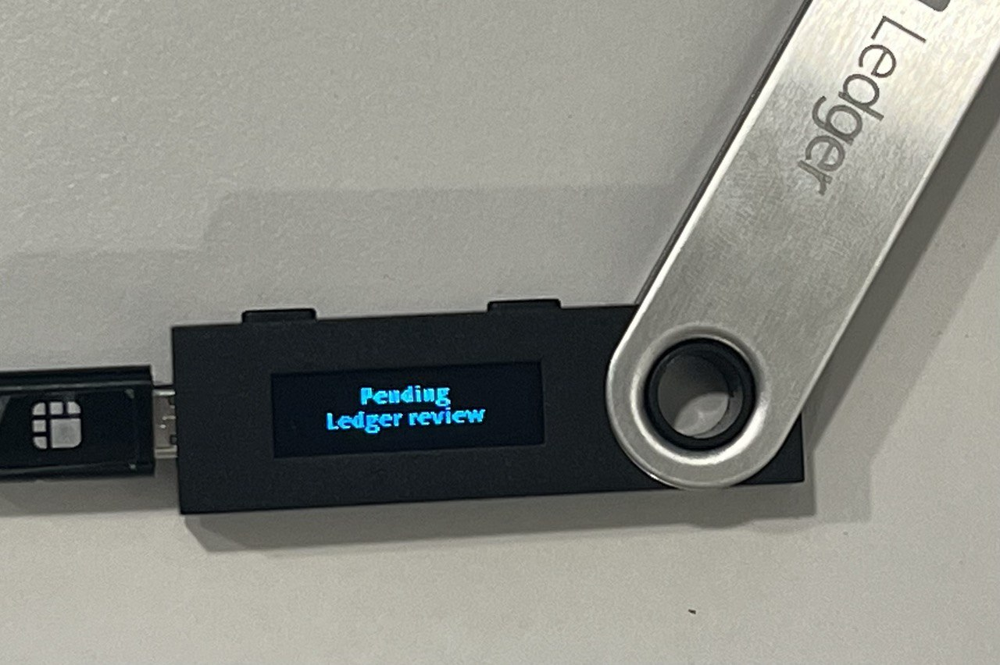
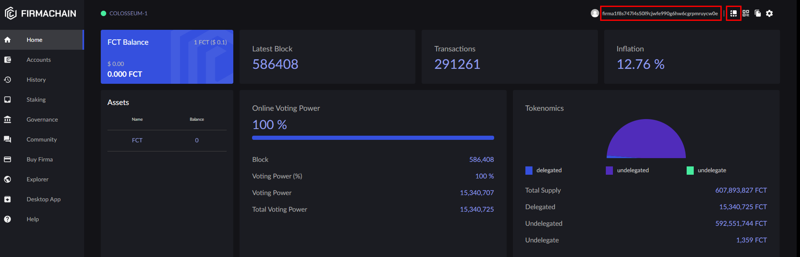
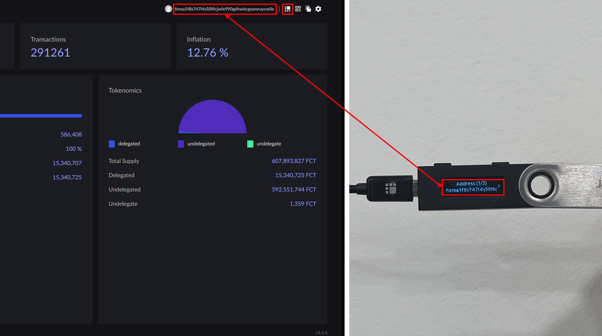

# Usage on FirmaStation

## Before Starting

Depending on the browser of your choice, some browsers may not support the Ledger Nano S/X/S Plus connection. Please check whether the browser of your choice supports Ledger connection.

| Browser       | is support |
| ------------- | ---------- |
| Chrome(Brave) | O          |
| Edge          | O          |
| Safari        | X          |

#### ★ If you use the desktop application, connection is supported on all OS.

## Connecting Your Ledger to FirmaStation

### 1. Connect your Ledger waller to the computer.

Once you connect your Ledger wallet to your computer, please enter the pin code to allow access. As you can see in the image below, you must be able to view the downloaded applications in the screen of your Ledger.

.png>)

### 2. Open the FirmaChain application.

You can navigate through the apps by using the two buttons located on the top of the Ledger. Once you choose the FirmaChain app, you can open the application by clicking the two buttons simultaneously.

_\* Currently, the "Firma Chain app" is distributed in developer mode, and the "Pending Ledger review" message is visible in developer mode. Press the top two buttons at the same time to move on._

<figure><figcaption></figcaption></figure>

### 3. Checking "Ledger Nano" Readiness.

As can be seen in the image below, you can see the phrase ‘FirmaChain ready’ in the screen of the ledger once you enter the FirmaChain app.

.png>)

### 4. Please login to FirmaStation.

Follow the instructions below to login to FirmaStation.

#### **4-1.** Access FirmaStation on your browser and click on the \[Login] button located on the top right corner of the page.

.png>)

#### 4-2. From the 4 login options, please select \[Connection to Ledger].

.png>)

#### 4-3. Start connecting to your Ledger.

 (1).png>)

#### 4-4. Allow your browser to connect to your Ledger wallet.

_\* If you are using the FirmaStation app, this access granting process is unnecessary._

.png>)

#### **4-5. Once you've successfully connected your Ledger to your wallet, you will be able to find your wallet address and a 'Ledger Icon' on the top right corner of your screen.**

#### **4-6. If you click on the 'Ledger Icon' you will be able to check your wallet address from your 'Ledger Nano S/X/S Plus'. Please check whether the address displayed on your 'Ledger Nano S/X/S Plus' and the address displayed on Firma Station match.**

You can check your wallet information or can use FCT for other purposes, which include but are not limited to, sending, delegating, withdrawing-rewards etc.

## Send Balances

### 1. Accessing from FirmaStation

From the menu bar located on the left of the screen, please select \[Accounts]. Once you’ve entered the \[Accounts] page, please click \[SEND to Address].

 (1).png>)

### 2. Fill in Send Transaction Information

.png>)

* \[Symbol] is the information of the token to be sent. If you issued a token, then you can also send/transfer the issued token.
* \[Send To] is the information of the recipient.
* \[Amount] designates the amount to be sent to the recipient. You can check the maximum transferable amount in the \[Available] section.\
  (Transaction fees are not included. Please calculate the transaction fee before sending the token.)
* You can put in additional information regarding this transaction in the \[Memo] section.

### 3. Signing Ledger Nano S/X/S Plus

Please click on \[Sign Ledger].

.png>)

Once you click on \[Sign Ledger], your status remains on standby until your Ledger Nano S/X/S Plus transaction information is received.

.png>)

### 4. Check your Ledger Nano Wallet

FirmaStation sends a signature request to the connected Ledger Nano S/X/S Plus. Please check the details of your transaction from your Ledger Nano S/X/S Plus. If any one of the information is incorrect, please choose ‘reject’ on the last step and try the process again.

_\* The images below are a brief explanation of the above process._

#### 4-1. FirmaChain Chain ID Screen

.png>)

#### 4-2. Transaction Type Screen

.png>)

#### 4-3. Transaction Approve or Reject Screen

.png>)

### 5. Approve Transaction

Once you click on the \[Approve] button on your Ledger Nano S/X/S Plus, you will receive a transaction success message from your browser a few seconds later. The details of your transaction can be seen in the \[Accounts] > \[Send History] page.

.png>)

## View Instruction Video

Following is a video that instructs how to use Ledger Nano S/X/S Plus on FirmaStation.&#x20;

_\* If you are going to follow the steps outlined in the video,_\
&#x20;  _please make sure you’ve completed the following steps prior to watching the instruction video._ \
&#x20;  1\) Connect your Ledger to your PC. \
&#x20;  2\) Enter your pin code. \
&#x20;  3\) Open FirmaChain app.



### Support

If you have any issue with your Ledger installation and use station, please join to our community channel and email.

Telegram : [https://t.me/firmachain\_global](https://t.me/firmachain\_global)\
Mailto : [contact@firmachain.org](mailto:contact@firmachain.org?bcc=contact@firmachain.org)
