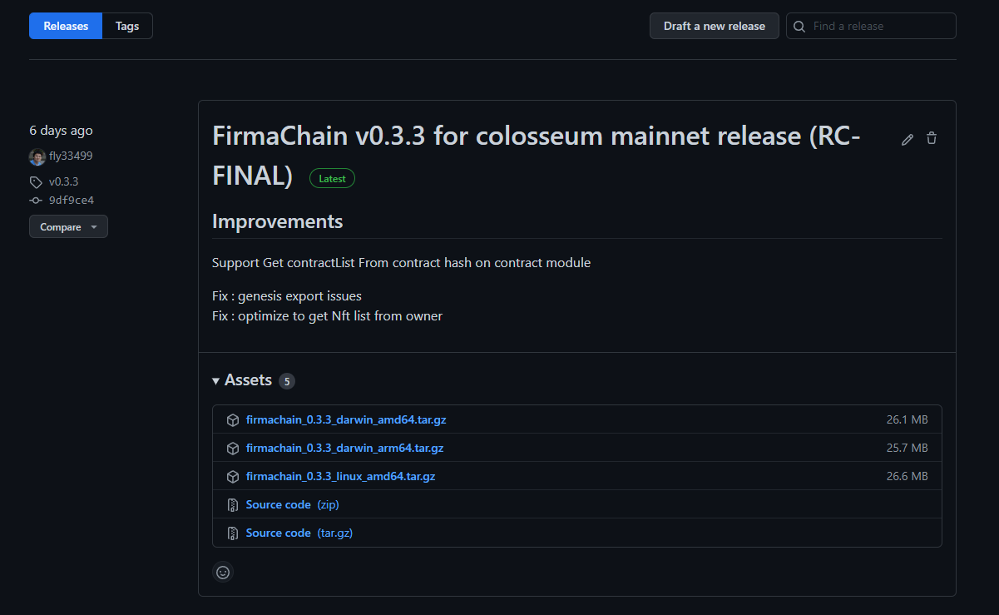

# Install

### Ways 1. Install FirmaChain from pre-built binary by curl

You can easily download a pre-built binary for your operating system using the command below.

#### download binary

```shell
# On Bash
curl https://build.firmachain.org | bash

sudo mv ./firmachaind /usr/local/bin/firmachaind
```

#### check version & sha1sum

```
firmachaind version
0.3.3
```

```
firmachaind version --long
name: Firmachain
server_name: firmachaind
version: 0.3.3
commit: 9df9ce421987823a94259bee257e436ba4562c3b
...
cosmos_sdk_version: v0.44.5
```

```
sha1sum /usr/local/bin/firmachaind
14cfd7a09d4d53293f07c65fbf7b9032140a0da6  firmachaind
```

### Ways 2. Download from Github Release page

You can download a prebuilt binary from the link below. [https://github.com/FirmaChain/firmachain/releases](https://github.com/FirmaChain/firmachain/releases)​​​



Select, download and unzip a binary that suits your OS.\
Please confirm whether you’ve downloaded the correct version, using the method provided in Ways 1.
