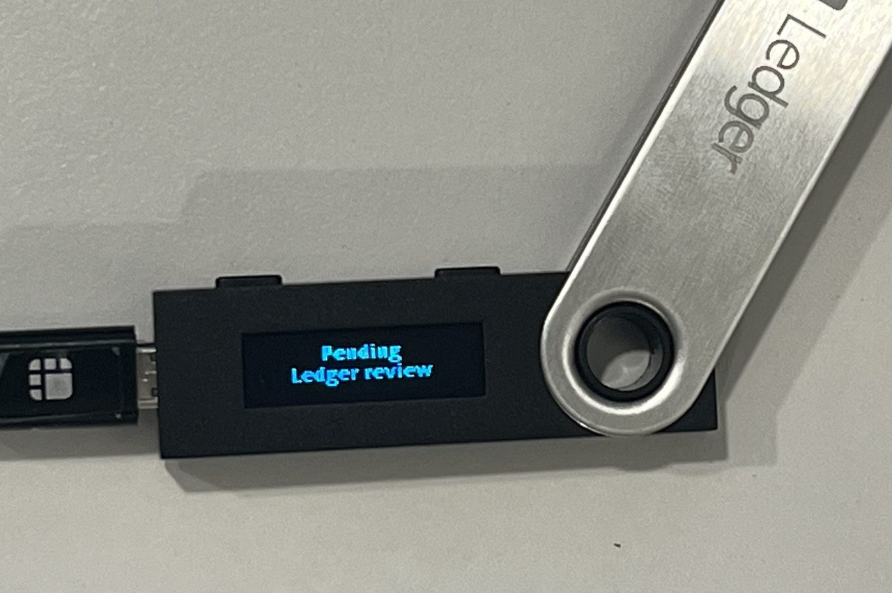

# Edit Validator Description

With the transaction provided in this guide, validator's can edit their publicly displayed information. The purpose of this process is to distinguish between different validators and all flags provided in this document must be filled. If you omit a flag, the field you omitted will be left blank.

_\* `--moniker` defaults to the machine name_

### Flag parameter

| Flags            | Type   | Description                                 |
| ---------------- | ------ | ------------------------------------------- |
| details          | string | Brief Introduction                          |
| website          | string | Your website address (only if you have one) |
| security-contact | string | Your e-mail address                         |
| identity         | string | keybase 64bit security code                 |

### How to edit description

```
firmachaind tx staking edit-validator \
--moniker "your moniker name" \
--website "introduce web site" \
--identity "key base 64bit code" \
--details "simple context" \
--chain-id <chain_id> \
--fees 20000ufct \
--from <key_name>
```

### How to get identity 64bit code

The process to retrieve this key data is relatively simple. Firstly, log in to keybase.io. Once you generate the key, copy and paste the code provided in the red box in the image below.

_\*_ _Do not include any space in the --identity field._


